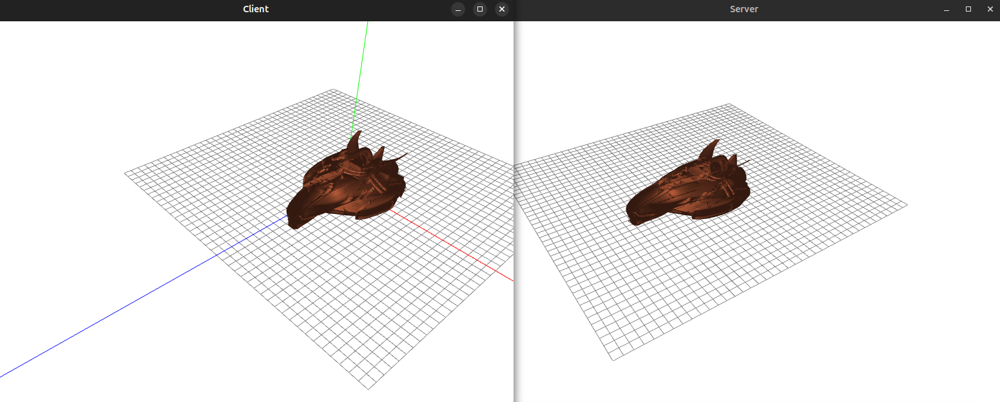

# SpaceShipGame

<h1 align="center">
    
</h1>


Этот проект представляет собой игровой движок с клиент-серверной архитектурой , реализованный на C++ с использованием ECS (Entity Component System), OpenGL, Boost.Serialization и Google Test. В движке реализованы:

Система управления объектами через команды
Физика движения и взаимодействия
Многоуровневая система обработки исключений
Поддержка сериализации мира
Клиент-серверная сетевая модель
Рендеринг 3D-сцен с поддержкой шейдеров (Phong, PBR, SSAO)

# запуск
запуск производить в таком порядке(не наоборот)
```
./example_GameServer - запуск сервера игры
./example_GameClient - запуск клиента игры 
```
# Управление
Клиент может управлять игроком с помощью следующих клавиш:
```
W Перемещение вверх
S Перемещение вниз
A Перемещение влево  (пока не работает)
D Перемещение вправо  (пока не работает)
Space запуск торпеды  (пока не работает)
```

# Структура проекта
```
.
├── libraries/
│   ├── ECSEngineLib/       # ECS ядро
│   ├── GameLogic/          # Логика игры, команды, игрок
│   ├── Visualization/      # Рендеринг, камера, шейдеры
│   ├── Commands/           # Команды и обработка исключений
│   └── network/            # Клиент-серверный код
├── tests/                  # Юнит-тесты
└── main/                   # Точка входа (клиент и сервер)
```
# Зависимости

Все зависимости скачиваются через fetchcontent\declare в папку проекта 3rdparty
Boost - сериализация, стектрейс при падении, asio для ip tcp подключения
glad - для загрузки символов opengl
glfw3 - открытие окна
glm - библиотека для матричных вычислений
assimp - для загрузки obj моделей
gtest - тесты

# Приложения

```
├── example_BVH
├── example_client
├── example_ECS
├── example_GameClient - клиент игры
├── example_GameServer - сервер игры
├── example_server
├── tests_BVH
├── tests_command
├── tests_ECS
├── tests_exceptionHandler
├── tests_GameLogic
├── tests_IOC
└── tests_Network
```

# сборка

```
mkdir build cd build
cmake .. -DCMAKE_INSTALL_PREFIX=<куда установить приложения>
ninja all -j16
ninja install
```

если нет интернета но 3rdparty скачана 

```
mkdir build cd build
cmake .. -DCMAKE_INSTALL_PREFIX=<куда установить приложения> -DFETCHCONTENT_FULLY_DISCONNECTED:BOOL=OFF
ninja all -j16
ninja install
```


# Автоматический подсчет coverage

Должен быть установлен lcov

```
sudo apt install -y clang
sudo apt install -y llvm
sudo apt install -y llvm-tools
sudo apt install -y llvm-dev
sudo apt install -y gcovr lcov
```

если его нет, чтобы не получить ошибку при конфигурировании

```
cmake \
-DBoundingVolumesHierarchy_BUILD_TESTS=OFF
-DCommands_BUILD_TESTS=OFF \
-DEntityComponentSystem_BUILD_TESTS=OFF \
-DGameLogic_BUILD_TESTS=OFF \
-DInversionOfControl_BUILD_TESTS=OFF \
-DNetwork_BUILD_TESTS=OFF \
-DSignals_BUILD_TESTS=OFF \
-DVisualization_BUILD_TESTS=OFF ..
```

```
mkdir build cd build
cmake .. -DCMAKE_INSTALL_PREFIX=<куда установить приложения>
ninja all -j16
ninja ccov-report-tests_BVH 
ninja ccov-report-tests_ECS
ninja ccov-report-tests_GameLogic 
ninja ccov-report-tests_IOC
ninja ccov-report-tests_Network 
ninja ccov-report-tests_command
ninja ccov-report-tests_exceptionHandler
```

# опции
```
option(${PROJECT_NAME}_BUILD_EXAMPLES "build examples" ON)
option(${PROJECT_NAME}_BUILD_TESTS "build tests" ON)
option(BUILD_SHARED_LIBS "Build using shared libraries" ON)
```

# диаграммы

Компоненты:


Шаблоны проектирования:


# Что осталось доделать 

- Микросервис jwt токенов
- Написать команду проверки коллизий между обьектами
- Дописать логику запуска торпед
- Дописать тесты на 90 % coverage